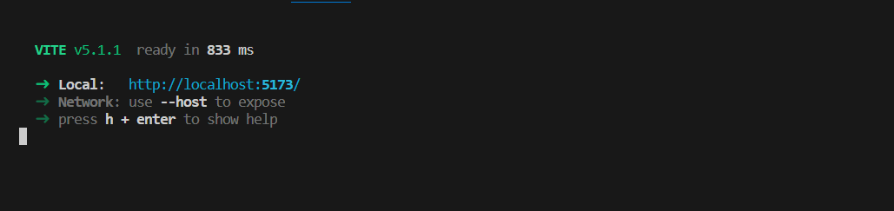

# project_groups_spa

A vue3 vite single-page application that filters and searches data from the http://localhost:3000/projects endpoint.

## Installation

```sh
npm install
```

## Usage example

(PLEASE MAKE SURE THE BACKEND IS RUNNING BEFOREHAND!)

Run the application, it uses vite for fast reloads.

```sh
npm run server
```
Once the command is done running you should see this on your terminal.



Next you can install the frontend.


### Lint with [ESLint](https://eslint.org/)

```sh
npm run lint
```
